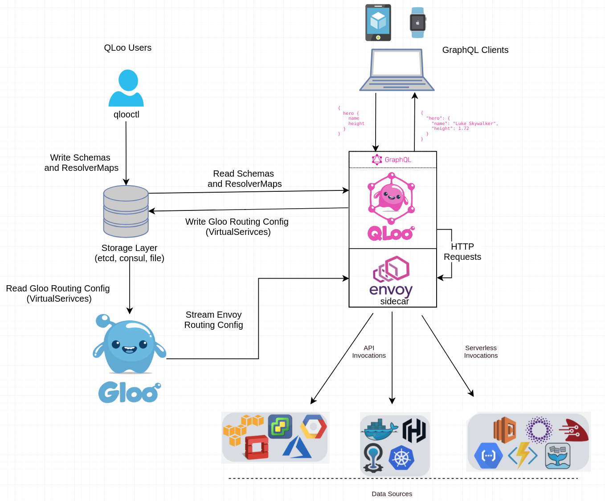

# Architecture

The Architecture of Sqoop can be understood as follows:

Sqoop users interact via the [Storage Layer API](https://github.com/solo-io/sqoop/tree/master/pkg/storage).

Declarative API Objects ([Schemas](../v1/schema.md) and [ResolverMaps](../v1/resolver_map.md)) are
written by the User (usually via `sqoopctl`, the Sqoop CLI) and polled by Sqoop.

When Sqoop detects an update to an API Object, it re-syncs its state to match
the user specified configuration.

Sqoop is composed of two components: a GraphQL service and an Envoy Proxy functioning as a sidecar. Rather than manually configuring
its own sidecar, Sqoop directs Envoy to connect to Gloo as its [control plane](https://github.com/envoyproxy/data-plane-api/blob/master/XDS_PROTOCOL.md), 
allowing Sqoop to leverage [Gloo's large set of HTTP routing features](https://gloo.solo.io/#features).

Sqoop generates [Gloo config objects](https://gloo.solo.io/v1/virtualservice/) in a self-service fashion, allowing Gloo
to handle service discovery, [Gloo plugin configuration](https://gloo.solo.io/plugins/aws/), and configuration of 
[Envoy HTTP Filters](https://www.envoyproxy.io/docs/envoy/latest/intro/arch_overview/http_filters.html)

Once Gloo has applied the desired configuration to Envoy, Sqoop begins listening for incoming GraphQL requests, serving queries 
against the schema(s) provided by the user(s), and making requests via Envoy based on the configuration in the user-defined [ResolverMaps](../v1/resolver_map.md)
